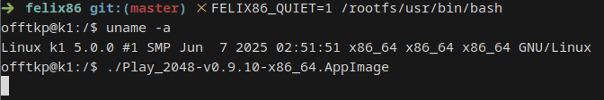

# How to use

felix86 runs x86 and x86-64 apps and games on RISC-V. These apps and games need their respective x86 libraries and tools that we package inside a directory (this is called **a rootfs**). This installation guide will help you install felix86 and a rootfs.

> [!IMPORTANT]
> felix86 is early in development. It can run some games, see https://felix86.com/compat/.
>
> Currently the emulator is only tested on boards with **VLEN=256**

## Step 0 - Requirements
You need a RISC-V board with `rv64gv` extensions. **RVV 1.0** is necessary.

To run the installation script, you'll need the following programs:
```
curl tar unzip sudo bash
```
They are installed by default in most distributions.

## Step 1 - Installation
Simply run the quick installation script:

```bash
curl -s https://raw.githubusercontent.com/OFFTKP/felix86/master/src/felix86/tools/install.sh -o /tmp/felix86_install.sh && bash /tmp/felix86_install.sh && rm /tmp/felix86_install.sh
```

This will guide you through the process of installing felix86 and downloading a rootfs.

## Step 2 - Usage
After running the installation script you should be ready to run x86 and x86-64 applications.

You can run them as if they are RISC-V applications. **Make sure they are inside the rootfs.**

It is recommended you "enter" the rootfs by running the x86-64 bash inside the rootfs:    
```
FELIX86_QUIET=1 /path/to/rootfs/usr/bin/bash
```

You should now be inside the rootfs.    
Here you can run your x86 and x86-64 applications, such as games:



The rootfs you downloaded should have enough libraries to support most games, but if any are missing use your **x86-64 package manager** to install them while inside the rootfs.    

> [!TIP]
> felix86 is quite verbose by default. The `FELIX86_QUIET` environment variable silences it.
>
> Alternatively, set the `quiet` variable to `true` in `$HOME/.config/felix86/config.toml`

## Step 3 - Tips
- There's multiple ways to run programs using felix86:
  - `felix86 /path/to/rootfs/program`
  - `felix86 /program`                   (will search inside rootfs only)
  - `/path/to/rootfs/program`            (make sure it's not a script, otherwise run it with felix86 prepended)
- If your GPU has x86/x86-64 drivers then they will be automatically used. Many RISC-V boards come with iGPUs that don't have x86 drivers and felix86 is not able to use them currently.
- The environment variable `FELIX86_ALWAYS_TSO=1` may be necessary for Unity games, random crashes may occur without it
- Not all games are going to work. If something doesn't work, open an issue on github!
- If your GPU has x86/x86-64 drivers, setting `FELIX86_ENABLED_THUNKS=glx` may make 64-bit games faster
- felix86 is **NOT a sandbox**, nor does it aim to be one, always run **trusted executables**
- felix86 logs are stored in /tmp

---

Join us on Discord for support and questions:    
https://discord.gg/TgBxgFwByU